# Contract Reviewer

An AI-powered Microsoft Word Add-in that reviews contracts, flags risky clauses, and suggests market-standard rewrites -- all from a task pane inside Word.

---

## Screenshots

### Analysis Methods
Before running, choose how the AI approaches the contract. Standard Review flags risk based on document type and jurisdiction. Playbook compares every clause against your firm's negotiating positions. Golden Sample benchmarks against executed contracts you trust. Manual Directions lets you write the review instructions yourself. Picking the right mode means the AI is working your angle, not a generic one.

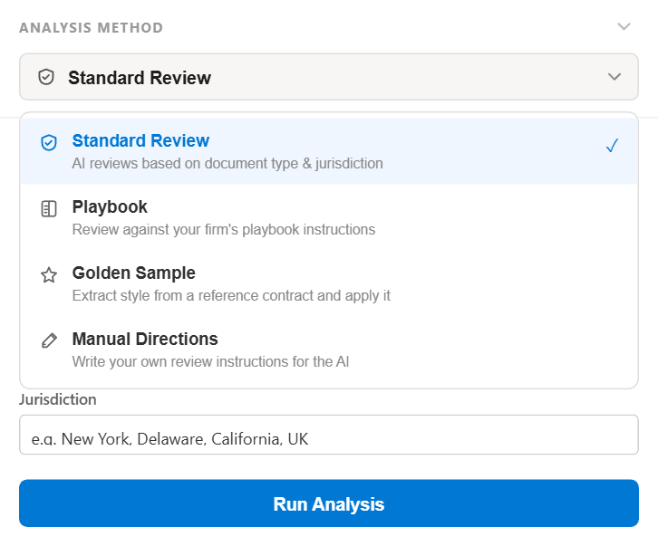

---

### Analysis Config
Buyer's counsel and seller's counsel want completely different redlines. Setting your perspective here (Buyer/Client, Seller/Vendor, or Neutral) shapes every flag and every suggestion. Contract stage and document type narrow the AI's focus further. Jurisdiction ensures the suggested language is appropriate for the governing law. Two minutes of setup means the AI is aligned before it reads a single clause.

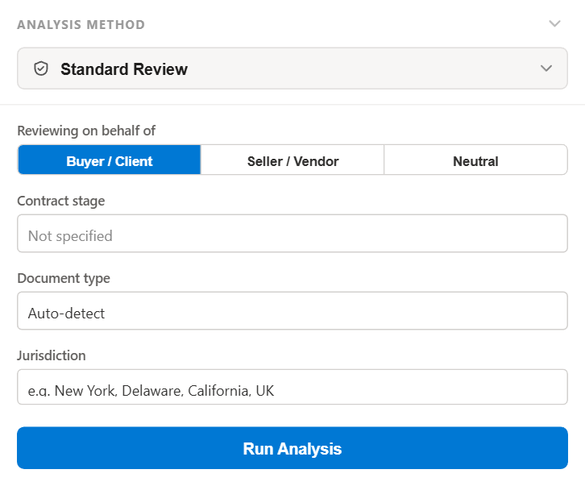

---

### Clause Card: Split View
A HIGH-risk Termination clause shown in Split view. The original problem language is crossed out in red; the market-standard replacement sits directly below in green. Context from the surrounding paragraph keeps the change in scope. One click on Apply inserts the redline directly into the Word document.

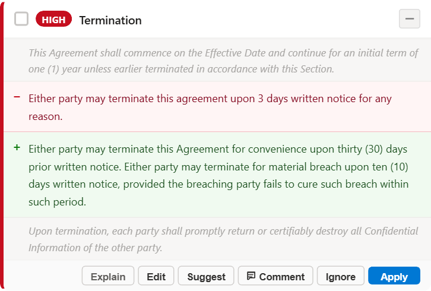

---

### Contract Health Score
After analysis, every open issue deducts from a 0-100 health score. Fixing clauses raises it in real time. The color-coded bars (HIGH, MEDIUM, LOW) give an instant triage view so you know where to spend your time. Difficulty stars and available XP reflect how complex the contract is; harder contracts pay out more. The footer tracks your current level, your team rank, and total lines fixed this week -- progress you can actually see.

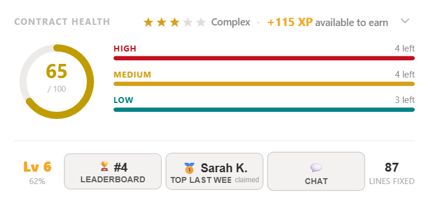

---

### Issues List
Every flagged clause in one scrollable list, sorted by risk. Each card shows the problematic language, the suggested replacement, and enough surrounding context to understand the stakes. You can Explain, Edit, Suggest, Comment, Ignore, or Apply directly from the card without leaving the task pane. Eleven issues, zero completed -- the score only goes up from here.

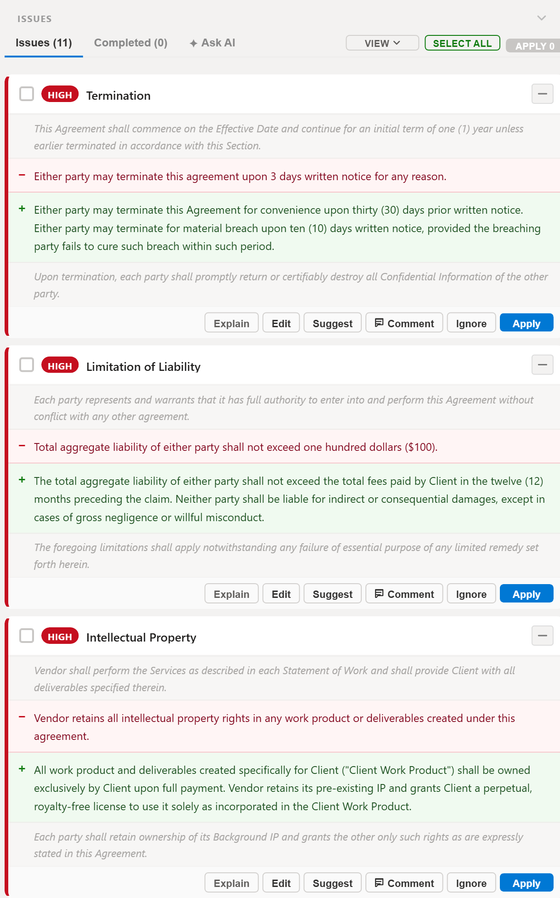

---

### View and Sort Options
Switch between Split (original versus suggested, side by side) and Inline (changes rendered in paragraph context, like Track Changes). Sort by document order to work top to bottom, or by severity to knock out the HIGH-risk clauses first. Experienced reviewers tend to sort by severity; associates working a first pass often prefer document order.

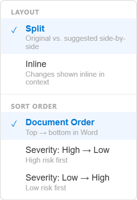

---

### Issues List: Inline View
The same clauses in Inline mode. Removed language appears as red strikethrough; the replacement follows in green, flowing naturally in the paragraph. This is closer to how Word's Track Changes looks, which makes it easier to read the contract as a whole while still seeing every proposed change.

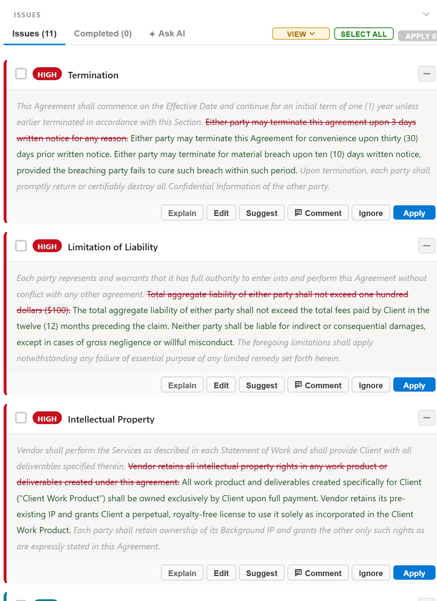

---

### Explain
Not sure why something was flagged? Explain opens a plain-English breakdown of the risk and a rationale for the suggested fix. Junior associates build judgment by reading these; senior attorneys use them to decide quickly whether to accept, modify, or ignore. Every clause the AI touches comes with a reason -- not just a replacement.

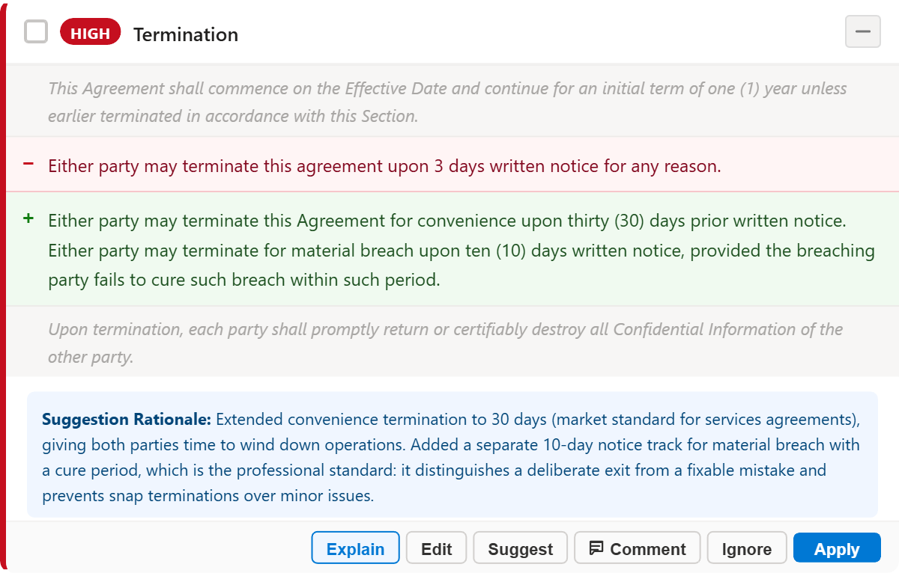

---

### Inline Edits
The Termination clause with the full redline rendered in paragraph context before it touches the document. The 3-day notice clause is struck through; the replacement covering 30-day convenience termination, a material breach cure period, and survival provisions follows inline. Preview first, apply when you are satisfied.

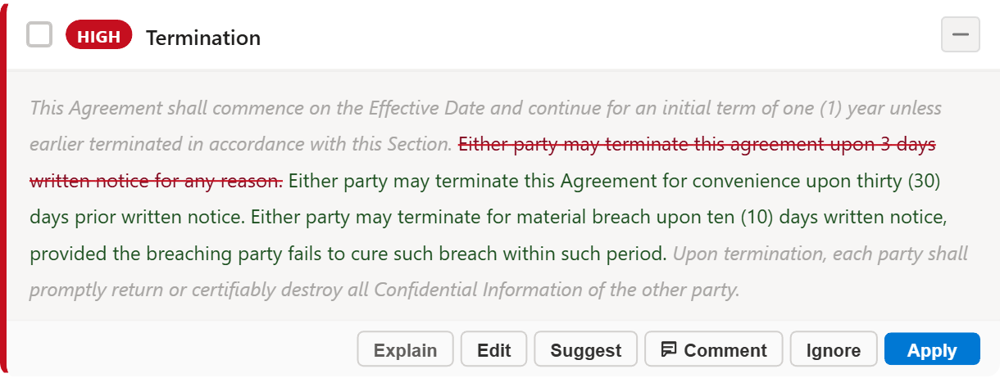

---

### Edit
The AI suggestion is a starting point, not a final draft. Edit mode pre-fills a text area with the proposed language so you can adjust it before it goes into the document. The original clause stays visible at the top for reference. You are still the lawyer -- the AI just does the first lift.

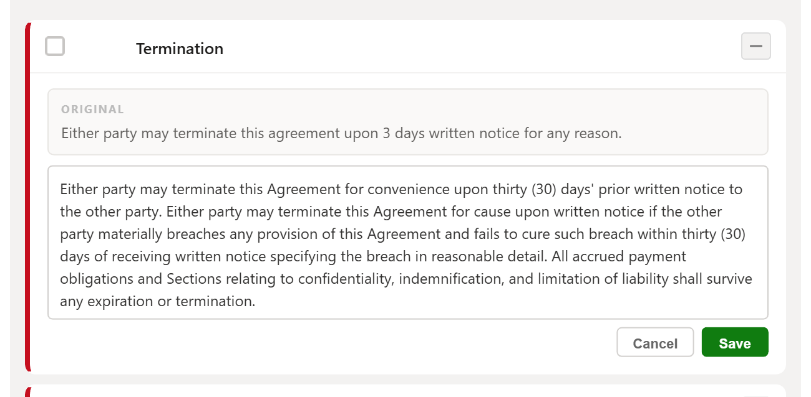

---

### Suggest
When the AI's default suggestion misses the mark, Suggest lets you direct it. Here an attorney has asked for a full rewrite to English law standards: 90-day notice (UK SaaS market standard), an insolvency trigger under the Insolvency Act 1986, and a third-party rights exclusion under the Contracts (Rights of Third Parties) Act 1999. The AI rewrites to spec and you review the result before applying.

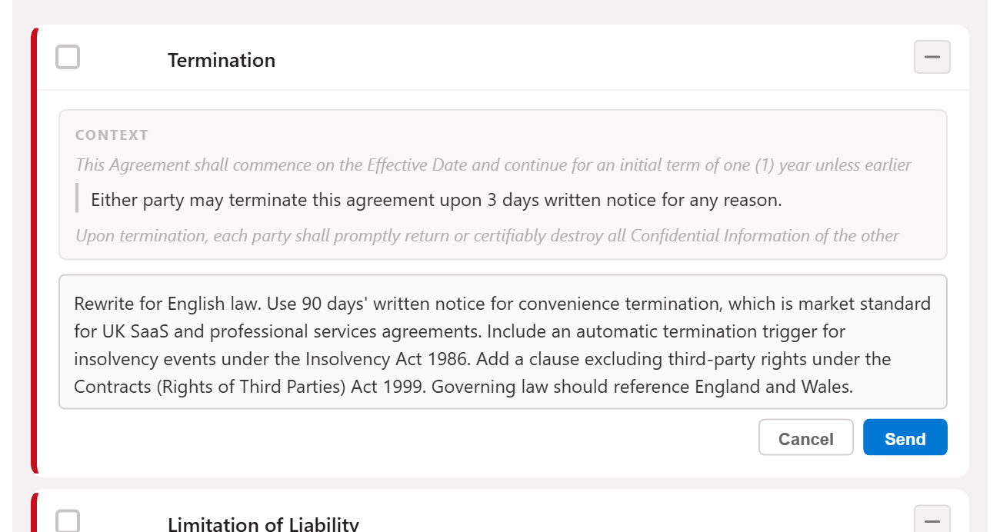

---

### Comment
Insert a Word comment explaining why a change was made, not just what changed. The text area comes pre-filled with the AI rationale so you are not writing from scratch. Edit it to match your voice, then insert with one click. Opposing counsel and clients see your reasoning directly in the document.

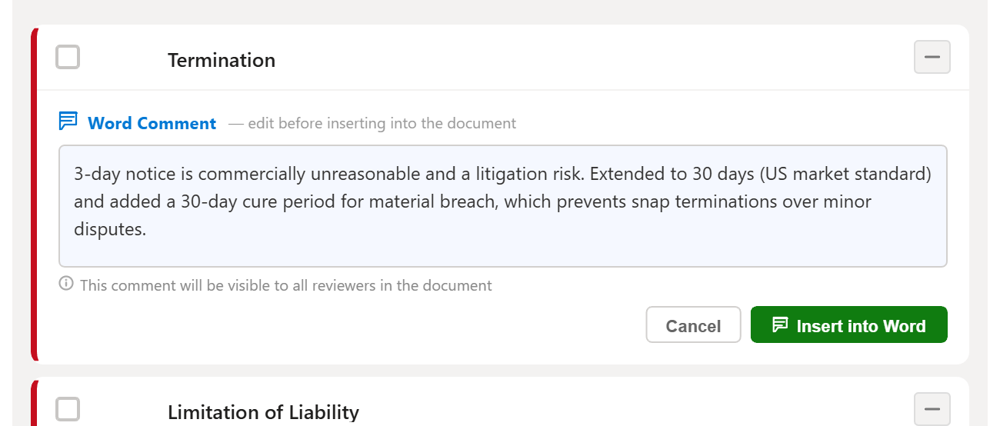

---

### Playbook Mode
Upload your firm's negotiating playbooks and the AI flags every clause that falls short of your preferred positions. Pinned playbooks (gold star) stay at the top for fast access. Supports up to 30 playbooks per user. Consistent firm positions across every deal, every attorney, without anyone having to memorize the fallback positions.

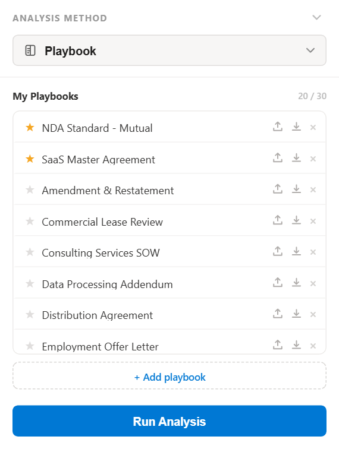

---

### Golden Sample Mode
Upload executed contracts you are happy with and the AI uses them as the benchmark. Instead of flagging against generic market standards, it flags against language you have already negotiated and won. The selected sample (blue highlight) is the one used in the next analysis. Pin your best contracts to keep them one tap away.

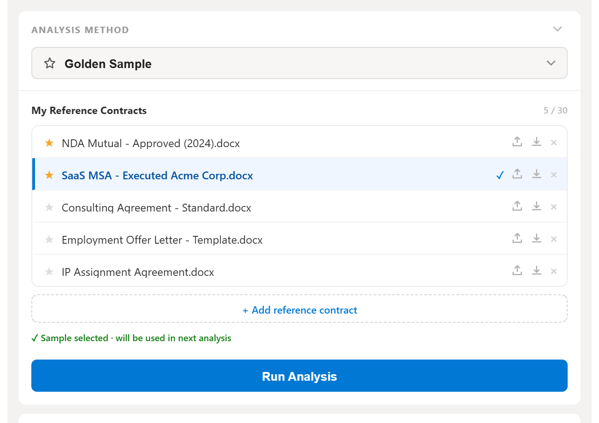

---

### Ask AI
A chat assistant with full context of the open contract, your loaded playbooks, and your golden samples. Ask anything: is this liability cap market standard for SaaS? What is the risk if we accept this indemnification carve-out? How would Delaware courts read this non-compete? The Web toggle adds live search for current precedent. Clause context is automatic -- no copying and pasting.

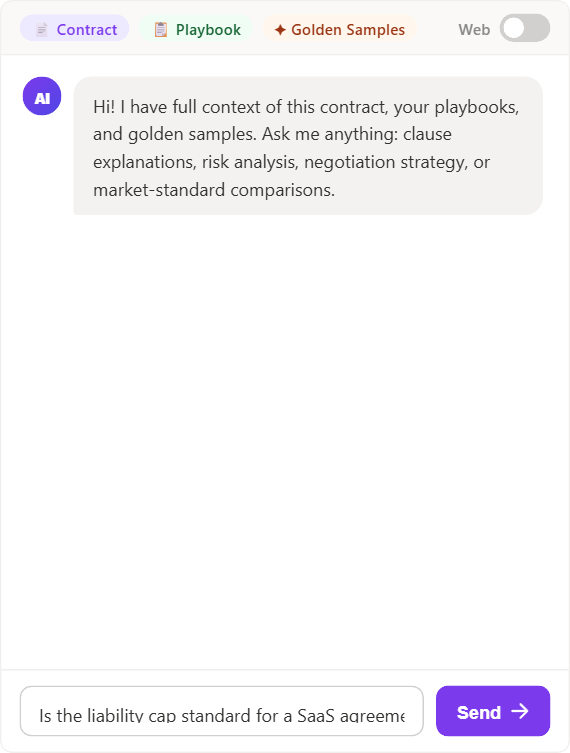

---

### Team Chat
A weekly team channel scoped to the current review period. Attorneys can share playbooks and golden samples directly in chat -- and every time a teammate downloads a file you shared, you earn XP. This is the party mechanic: knowledge sharing is rewarded the same way fixing clauses is. Posting your best NDA playbook and watching your XP tick up every time someone uses it turns institutional knowledge into a team sport rather than a hoarded advantage.

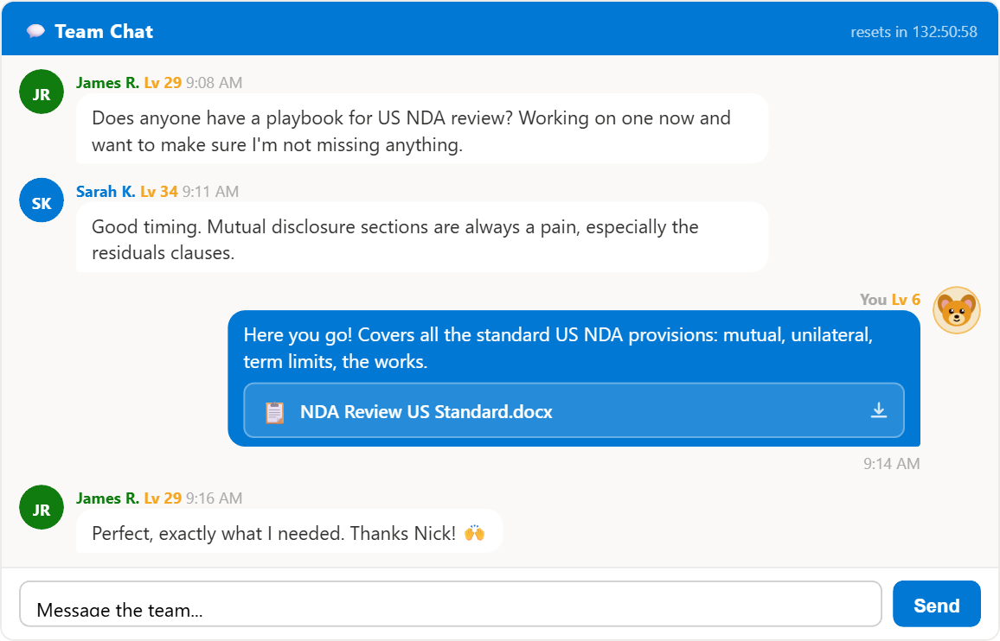

---

### Weekly Leaderboard
Resets every Monday. Top three earn XP prizes (1,000 / 500 / 250 XP) and the prior week's winner gets a public shoutout and bonus XP. The leaderboard makes the week feel like a sprint with a finish line, not a treadmill. Attorneys who might never track their output start paying attention when it is right there on screen next to their teammates'.

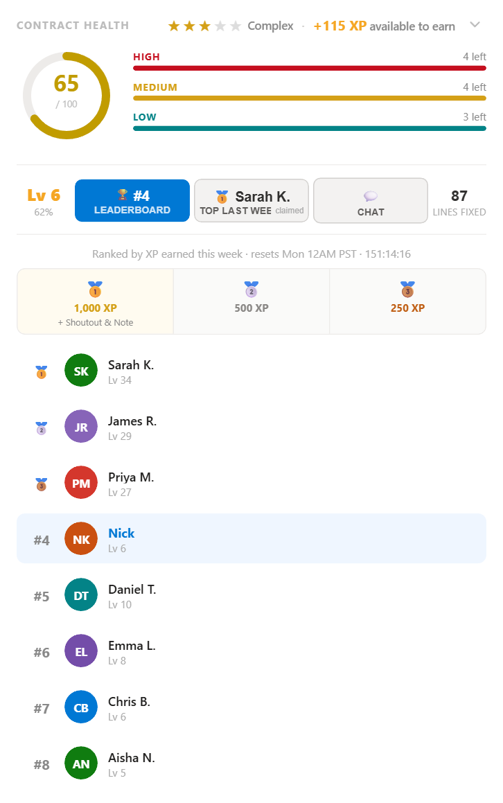

---

### Level Up
Every time you cross an XP threshold, a full-screen modal fires over the document. Levels correspond to career titles (Paralegal through Managing Partner), so progress feels meaningful rather than arbitrary. At the Managing Partner tier, missing a day triggers XP decay -- there is no coasting at the top. Contract reviewing has always been billable work; this makes it feel like something worth getting good at.

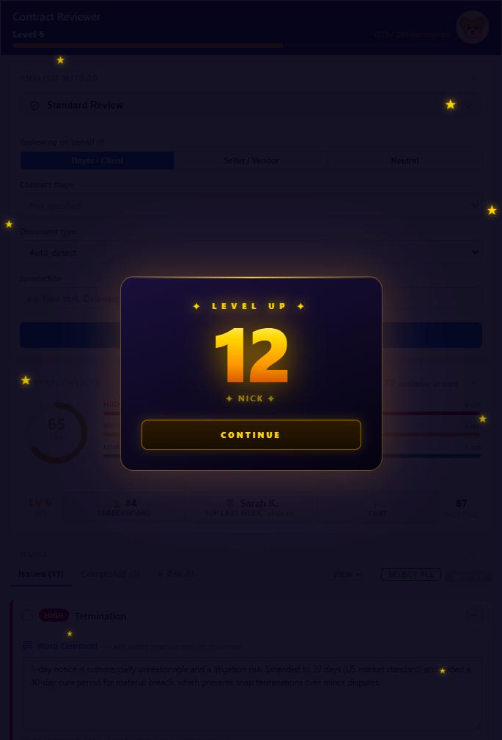

---

## Features

**AI Analysis**
- Flags HIGH, MEDIUM, and LOW risk clauses using Claude claude-opus-4-6
- Assigns a difficulty rating (1-5 stars) to the contract
- Supports Standard, Playbook, Golden Sample, and Manual Directions review modes
- Perspective toggle: Buyer / Client, Seller / Vendor, or Neutral

**Redlining**
- One-click Apply inserts the suggested replacement directly into the Word document
- Edit mode lets you manually adjust the suggestion before applying
- Suggest lets you describe what you want and AI rewrites on demand
- Bulk select and apply multiple clauses at once
- Split view (original vs. suggestion) or Inline view (changes in context)
- Sort by document order, high-to-low severity, or low-to-high severity

**Contract Health Score**
- Animated circular gauge updates in real time as clauses are fixed
- Score deducts by risk level and recovers as issues are resolved
- Stars and XP multiplier reflect contract difficulty

**XP and Career Progression**
- Earn XP for every clause fixed, scaled by risk level and contract difficulty
- Career ladder: Paralegal, Junior Associate, Senior Associate, Partner, Managing Partner
- Roughly 1,000 contracts to reach Managing Partner
- Managing Partner tier has daily XP decay -- miss a day and lose ground

**Daily Streak**
- Flame icon in the header tracks consecutive active days
- Streak bonuses at 3, 7, and 30 days

**Level Up Modal**
- Full-screen animated overlay fires every time you cross a level threshold
- Shows new level number and your display name

**Team Leaderboard**
- Weekly redline count across your team
- Resets every Monday
- Prior week top performer gets a shoutout with bonus XP prize

**Team Chat**
- Persistent weekly channel for the legal team
- Scoped to the current review week

**Ask AI**
- Clause-aware chat with full contract, playbook, and golden sample context
- Optional web search for live market comparisons
- Ask about any clause, risk, or negotiation tactic

**Playbook Compare**
- Upload and manage multiple negotiating playbooks
- AI flags gaps between the contract and your preferred positions
- Pin, download, or delete saved playbooks

---

## Stack

| Layer | Technology |
|---|---|
| Frontend | React 18, TypeScript, Fluent UI, Framer Motion |
| Backend | Node.js, Express, TypeScript |
| Database | PostgreSQL + Prisma ORM |
| AI | Anthropic Claude API (claude-opus-4-6) |
| Auth | MSAL (Microsoft SSO) |
| Add-in scaffolding | Yeoman Office generator |
| Build | Webpack (frontend), ts-node / nodemon (backend) |

---

## Project Structure

```
redlining-word-app/
  frontend/          React Word Add-in task pane
    src/
      components/    App.tsx -- main UI
      services/      api.ts, wordService.ts
      taskpane/      HTML entry point and index
  backend/           Express API server
    src/
      config.ts      Zod-validated env config
      routes/        analyze, rewrite, summarize, chat, playbook, leaderboard
      services/      claudeService, statsService, contractParser
      middleware/     auth (MSAL), rateLimit, errorHandler
      jobs/          xpDecay cron (daily, Managing Partner tier only)
      lib/           prisma singleton
    prisma/          schema.prisma + migrations
    __tests__/       Jest test skeletons
  docs/
    screenshots/     Demo screenshots for README
```

---

## Getting Started

### Prerequisites

- Node.js 20+
- PostgreSQL
- An [Anthropic API key](https://console.anthropic.com/)
- An Azure AD app registration (for MSAL auth in production)
- [mkcert](https://github.com/FiloSottile/mkcert) for local HTTPS

### 1. Install dependencies

```bash
npm install
```

### 2. Configure the backend

```bash
cp backend/.env.example backend/.env
```

Fill in `DATABASE_URL`, `ANTHROPIC_API_KEY`, and `AZURE_*` values. Set `SKIP_AUTH=true` and `MOCK_AI=true` to run locally without Azure AD or real API calls.

### 3. Run database migrations

```bash
cd backend && npm run db:migrate
```

### 4. Start both servers

```bash
# From the repo root
npm run start:backend   # port 5001
npm run start:frontend  # port 3000
```

The task pane is served at `http://localhost:3000/taskpane.html`.

To sideload into Word, follow the [Microsoft Office Add-ins quickstart](https://learn.microsoft.com/en-us/office/dev/add-ins/quickstarts/word-quickstart).

---

## Environment Variables

See `backend/.env.example` for the full list. Key variables:

| Variable | Description |
|---|---|
| `DATABASE_URL` | PostgreSQL connection string |
| `ANTHROPIC_API_KEY` | Claude API key |
| `FRONTEND_ORIGIN` | Allowed CORS origin (e.g. https://localhost:3000) |
| `SKIP_AUTH` | Set to `true` in development to bypass MSAL |
| `MOCK_AI` | Set to `true` to use mock Claude responses |
| `PORT` | Backend port (default 5001) |

---

## Running Tests

```bash
# Backend
cd backend && npm test

# Frontend
cd frontend && npm test
```

---

## Distribution

The add-in is built for Microsoft AppSource distribution. The manifest GUID is fixed and must not be changed after first submission. See `frontend/src/taskpane/manifest.xml`.

---

## License

MIT
